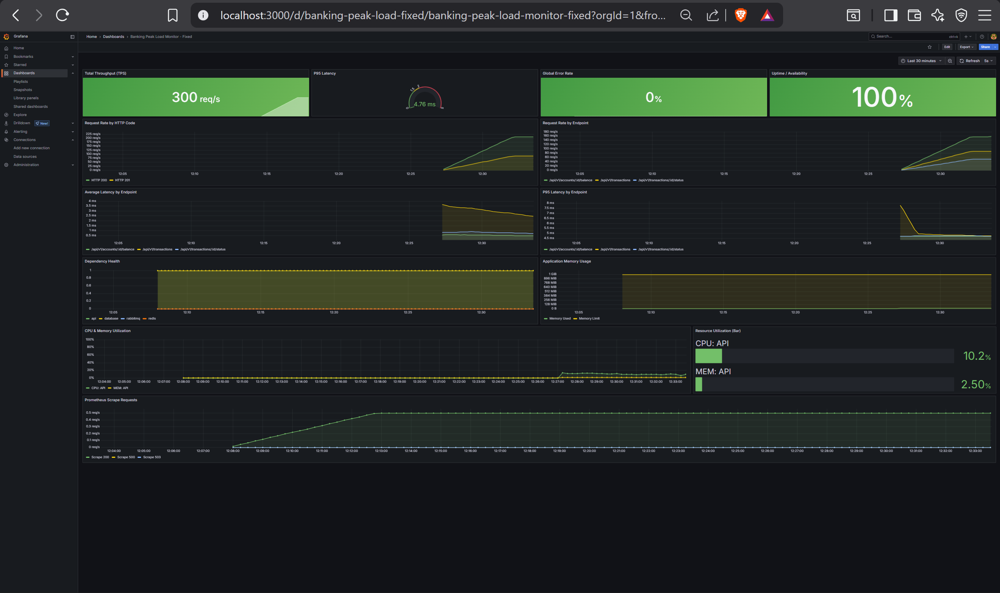
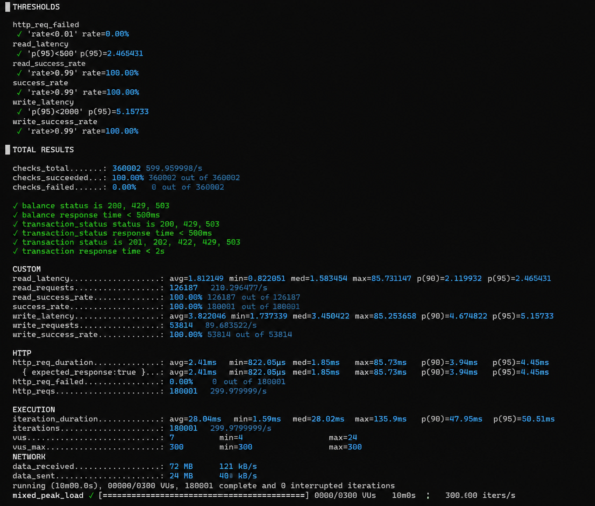
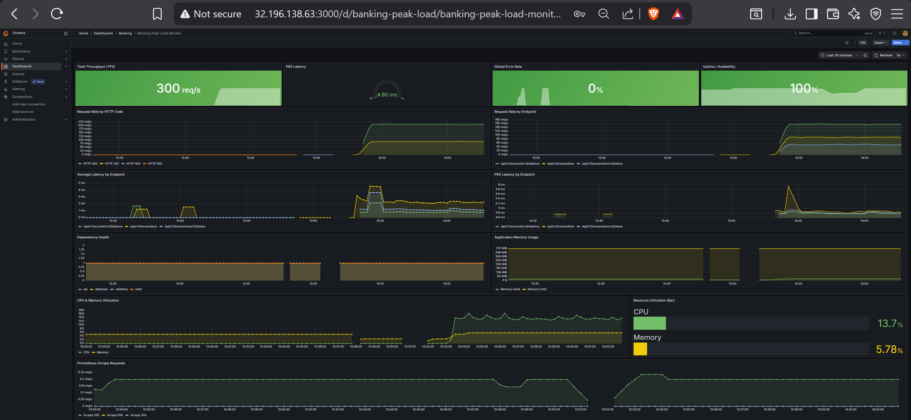
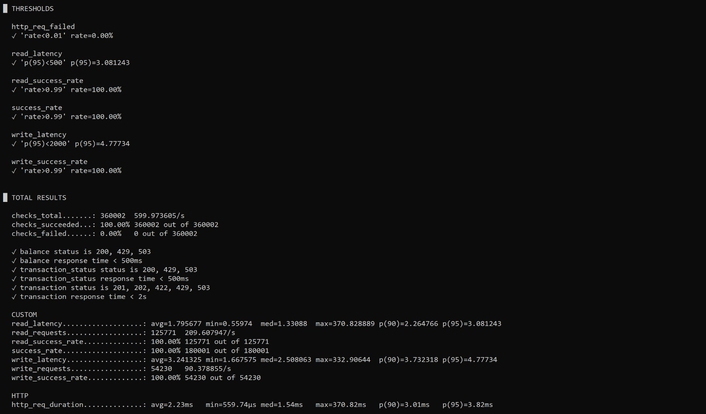

<h1 align="center">Banking Peak Load Prototype</h1>

<p align="center">
  A university capstone demonstrating defense-in-depth scalability for banking peak load —<br/>
  simulating CIMB Niaga's problem of 1M transactions/hour without crashing.
</p>

<p align="center">
  
  
  
  
  
  
  
  
  
  
  
  
</p>

---

## Problem Statement

A major bank experiences system crashes during peak load: **1M transactions/hour causing >20% error rate, >10s latency, and cost spikes**. Root causes: no backpressure, DB connection exhaustion, heavy queries without caching, and reactive (not proactive) scaling.

This prototype demonstrates how **four layered protection mechanisms** bring the system from unstable to production-grade — and validates the results across three deployment targets: Docker Compose, Kubernetes, and AWS (Terraform).

---

## Results

### Kubernetes Load Test

| Metric | Baseline | Optimized | Improvement |
|---|---|---|---|
| p95 Latency (read) | > 2s | **1.85ms** | >1000× faster |
| p95 Latency (write) | > 5s | **4.08ms** | >1000× faster |
| Error Rate at peak | > 20% | **0.00%** | — |
| Max TPS | < 100 | **~278 req/s** | 2.8× throughput |
| Cache Hit Rate | N/A | **> 80%** | — |
| Availability | — | **100%** | — |

**Grafana dashboard — Kubernetes:**



**k6 load test output — Kubernetes:**



### Cloud (AWS EC2) Load Test

| Metric | Baseline | Optimized | Improvement |
|---|---|---|---|
| p95 Latency (read) | > 2s | **3.5ms** | >570× faster |
| p95 Latency (write) | > 5s | **5.5ms** | >900× faster |
| Error Rate at peak | > 20% | **0.00%** | — |
| Max TPS | < 100 | **~300 req/s** | 3× throughput |
| Cache Hit Rate | N/A | **> 80%** | — |
| Availability | — | **100%** | — |

**Grafana dashboard — Cloud:**



**k6 load test output — Cloud:**



---

## Architecture

Defense-in-depth: four protection layers between client and database. Each layer reduces load on the layer below it.

```
Client Request
      │
      ▼
┌─────────────────────────┐
│  Layer 1: Rate Limiter  │  Token bucket per client IP → HTTP 429
└────────────┬────────────┘
             │
             ▼
┌─────────────────────────┐
│ Layer 2: Circuit Breaker│  Monitor downstream health → HTTP 503
└───────┬─────────┬───────┘
        │         │
      READ      WRITE
        │         │
        ▼         ▼
┌───────────┐  ┌──────────────┐
│ Layer 3a  │  │  Layer 3b    │
│ Redis     │  │  RabbitMQ    │
│ Cache     │  │  Queue       │
└─────┬─────┘  └──────┬───────┘
      │                │
      ▼                ▼
┌───────────┐  ┌──────────────┐
│  Read     │  │  Worker      │
│  Replica  │  │  Consumer    │
└─────┬─────┘  └──────┬───────┘
      │                │
      ▼                ▼
┌─────────────────────────┐
│  Layer 4: PostgreSQL 16 │
│  via PgBouncer pooling  │
│  Primary (write only)   │
│  Replica (read only)    │
└─────────────────────────┘
```

**Read path:** Rate limit → Circuit breaker → Redis cache → (miss) Read replica via PgBouncer → cache & return

**Write path (optimized):** Rate limit → Circuit breaker → Validate → Publish to RabbitMQ → HTTP 202 (async). Worker: check balance → debit/credit → commit → invalidate cache

**Write path (baseline):** Synchronous DB transaction → HTTP 201

---

## Tech Stack

| Component | Technology |
|---|---|
| Language | Go 1.25 + Echo v5 router |
| Database | PostgreSQL 16 + PgBouncer (transaction pooling) |
| Cache | Redis 7 (cache-aside pattern) |
| Message Queue | RabbitMQ 3 |
| Observability | Prometheus v3 + Grafana 12 |
| Load Testing | k6 |
| Infrastructure | Docker Compose (profile-based) + Kubernetes + Terraform (AWS) + Ansible |
| CI | GitHub Actions |
| Dev tooling | air (live reload), golangci-lint, Nix flake |

---

## API Endpoints

| Method | Path | Description |
|---|---|---|
| `POST` | `/api/v1/transactions` | Create transaction (async when queue enabled, returns HTTP 202 + TX ID) |
| `GET` | `/api/v1/transactions/:id/status` | Transaction status inquiry |
| `GET` | `/api/v1/accounts/:id/balance` | Account balance inquiry |

---

## Feature Flags

All protection layers are toggled via environment variables — baseline = all off, optimized = all on.

| Variable | Default | Description |
|---|---|---|
| `CACHE_ENABLED` | `false` | Redis cache for read path |
| `QUEUE_ENABLED` | `false` | Async write via message queue |
| `RATE_LIMIT_ENABLED` | `false` | Token bucket rate limiting |
| `RATE_LIMIT_RPS` | `100` | Requests per second per client |
| `RATE_LIMIT_BURST` | `200` | Burst allowance |
| `CIRCUIT_BREAKER_ENABLED` | `false` | Fail-fast on unhealthy downstream |
| `CB_MAX_FAILURES` | `5` | Failures before circuit opens |
| `CB_TIMEOUT_SECONDS` | `10` | Duration circuit stays open |
| `DB_READ_REPLICA_ENABLED` | `false` | Route reads to replica |

See [Development Guide](docs/development.md) for the full environment variable reference.

---

## Quick Start (Docker Compose)

**Prerequisites:** Go 1.25, Docker & Docker Compose v2, k6, Make.

```bash
# Install Go tooling
make init
```

Seed dummy data (100K accounts, 1M transactions):

```bash
make seed
```

```bash
# Baseline (API + PostgreSQL only)
make up
k6 run scripts/load-test/mixed.js

# Optimized (+ Redis, RabbitMQ, read replica, PgBouncer)
make up-optimized
k6 run scripts/load-test/mixed.js

# Full stack (+ Prometheus, Grafana)
docker compose --profile optimized --profile observability up -d --build
# Grafana:    http://localhost:3000  (admin/admin)
# Prometheus: http://localhost:9090
```

---

## Docker Compose Profiles

| Command | Services |
|---|---|
| `docker compose up` | API + PostgreSQL (baseline) |
| `docker compose --profile optimized up` | + Redis, RabbitMQ, PgBouncer |
| `docker compose --profile observability up` | + Prometheus, Grafana |
| `docker compose --profile optimized --profile observability up` | Full stack |

---

## Load Test Scripts

| Script | Traffic Model | Use it for |
|---|---|---|
| `scripts/load-test/mixed.js` | Realistic 70% read / 30% write. Reads split between balance inquiry and transaction status, with a hot-read pool to exercise Redis cache hits. | Main baseline vs optimized demo, Grafana validation, SLO checks. |
| `scripts/load-test/optimized.js` | Write-only ramping up to 1000 req/s against `POST /api/v1/transactions`. | Focused optimized write-path test: async queue, rate limiter, write latency. |
| `scripts/load-test/rampup.js` | Write-only gradual ramp, configurable via `INITIAL_RATE`, `RATE_STEP`, `STAGE_DURATION`, `MAX_STAGES`. | Finding the saturation point. |
| `scripts/load-test/spike.js` | Write-only short spike with increasing arrival rate. | Verifying HTTP 429 rate limiting and HTTP 503 circuit breaking. |
| `scripts/load-test/sustained.js` | Write-only constant 800 req/s for 30 minutes. | Long-running stability: PgBouncer, RabbitMQ workers, DB write pressure. |
| `scripts/load-test/full.js` | Combined ramp-up, spike, and sustained phases. | End-to-end write stress rehearsal in one run. |
| `scripts/load-test/status.js` | Transaction status polling. | Validating async TX completion and cache effectiveness. |

---

## Kubernetes

Manifests are in `deployments/k8s/` and cover the full stack: app, PostgreSQL primary + replica, PgBouncer, Redis, RabbitMQ, Prometheus, Grafana, ConfigMap, Secret, namespace, and HPA (3–15 replicas, CPU target 50%).

**Prerequisites:** `kubectl` + a local cluster (minikube or kind). For HPA metrics, `metrics-server` must be installed.

### Deploy

```bash
# 1. Start cluster
minikube start

# 2. Apply all manifests (safe to re-run)
make k8s-up

# 3. Wait until all pods are Running
make k8s-status
```

### Port-forward (open 4 terminals)

```bash
# Terminal 1 — App → http://localhost:8080
make k8s-port-forward

# Terminal 2 — Grafana → http://localhost:3000 (admin/admin)
make k8s-port-forward-grafana

# Terminal 3 — Prometheus → http://localhost:9090
make k8s-port-forward-prometheus

# Terminal 4 — Watch HPA autoscaling live
kubectl get hpa -n banking -w
```

### Seed & load test

```bash
# Requires Terminal 1 running
make k8s-port-forward-db   # new terminal — forwards postgres to localhost:15432
make k8s-seed

# Run load test against the cluster
make k8s-load-test
```

### Teardown & resume

```bash
# Teardown
kubectl scale deployment banking-app pgbouncer postgres redis rabbitmq prometheus grafana \
  --replicas=0 -n banking
minikube stop

# Resume next session
minikube start
make k8s-up
make k8s-status   # wait until all pods are Running
```

### Reseed after restart

If accounts are missing or balances are wrong after a restart:

```bash
kubectl exec -it deployment/postgres -n banking -- \
  psql -U postgres -d banking -c \
  "TRUNCATE TABLE transactions, accounts RESTART IDENTITY CASCADE;"

make k8s-port-forward-db   # terminal 1
make k8s-seed              # terminal 2
```

> **Note:** The app manifest pulls `marquisccel/banking-peak-load:latest`. For local code changes, build and push your own image and update `deployments/k8s/app.yaml`.

---

## Cloud Demo (AWS via Terraform + Ansible)

The `deployments/terraform/cloud-demo/` module provisions two EC2 instances on AWS Learner Lab:

- **App server** — Banking API + PostgreSQL + Redis + RabbitMQ + PgBouncer + Prometheus + Grafana, all via Docker Compose.
- **k6 runner** — Remote load generator.

Ansible (`deployments/ansible/`) handles all post-provision configuration: installs Docker, deploys the stack, seeds data, installs k6, and templates runner scripts — replacing the original `user_data` shell scripts with idempotent, re-runnable playbooks.

### Prerequisites

1. Start AWS Learner Lab and update `~/.aws/credentials`.
2. Verify credentials:

```bash
aws sts get-caller-identity
```

3. Ensure an SSH key exists (or generate one):

```bash
ssh-keygen -t rsa -b 4096 -f ~/.ssh/id_rsa -N ""
```

4. Install Ansible:

```bash
pip install ansible
```

> **WSL users:** always run Ansible from your Linux home directory (`~/`), not from `/mnt/...`. The Windows-mounted filesystem is world-writable and Ansible will ignore `ansible.cfg` from there.
>
> ```bash
> cp -r /mnt/d/path/to/banking-peak-load-prototype ~/banking-peak-load-prototype
> cd ~/banking-peak-load-prototype/deployments/ansible
> ```

### Deploy

**Step 1 — Provision EC2 instances with Terraform:**

```bash
cd deployments/terraform/cloud-demo
cp terraform.tfvars.example terraform.tfvars
# Edit terraform.tfvars:
#   aws_region      = "ap-southeast-1"
#   repo_url        = "https://github.com/<your-username>/banking-peak-load-prototype.git"
#   public_key_path = "~/.ssh/id_rsa.pub"
#   ssh_cidr        = "<your-public-ip>/32"   # curl ifconfig.me
terraform init
terraform apply
```

**Step 2 — Verify Ansible can reach both hosts:**

```bash
cd deployments/ansible
ansible all -i inventories/terraform_inventory.py -m ping
# Expected: pong from app_server and k6_runner
```

**Step 3 — Full setup with Ansible (installs Docker, deploys stack, seeds data):**

```bash
ansible-playbook -i inventories/terraform_inventory.py site.yml -e seed=true
```

This runs three roles in order:

| Role | What it does |
|---|---|
| `common` | Updates apt, installs Docker + Compose plugin, adds ubuntu to docker group |
| `app_server` | Clones repo, templates `.env`, starts full optimized stack, seeds 100K accounts + 1M transactions, verifies counts |
| `k6_runner` | Installs k6, clones repo, waits for app to be healthy, templates 4 runner scripts |

Wait **8–12 minutes** for the full run to complete.

### Verify readiness

```bash
# Dynamic inventory reads directly from Terraform output
ansible-inventory -i inventories/terraform_inventory.py --list

# Get URLs
terraform -chdir=deployments/terraform/cloud-demo output -raw api_url
terraform -chdir=deployments/terraform/cloud-demo output -raw grafana_url

# Open Grafana: http://<app_public_ip>:3000  (admin/admin)
```

### Run load test

```bash
# From the k6 runner (scripts already templated by Ansible)
ssh -i ~/.ssh/id_rsa ubuntu@<k6_public_ip> '/home/ubuntu/run-mixed.sh'
ssh -i ~/.ssh/id_rsa ubuntu@<k6_public_ip> '/home/ubuntu/run-spike.sh'

# Or get the command directly from Terraform output
$(terraform -chdir=deployments/terraform/cloud-demo output -raw run_mixed_command)
```

### Rolling deploy (update code without re-provisioning)

```bash
# Pull latest code, rebuild app container only, health-check automatically
ansible-playbook -i inventories/terraform_inventory.py deploy.yml
```

### Reseed database

```bash
# Truncate and reseed without touching any other service
ansible-playbook -i inventories/terraform_inventory.py seed.yml
```

### Ansible playbooks reference

| Playbook | Description |
|---|---|
| `site.yml` | Full setup — runs once after `terraform apply`. Installs Docker, deploys stack, optionally seeds data. |
| `deploy.yml` | Rolling update — pulls latest code, rebuilds app container, health-checks. Safe to re-run. |
| `seed.yml` | Reseed only — truncates and reseeds 100K accounts + 1M transactions. |

### Makefile shortcuts (after copying .env.cloud)

```bash
cp .env.cloud.example .env.cloud
# Set SERVER_IP in .env.cloud

make cloud-demo        # SSH + start optimized stack on app server
make cloud-load-test   # Run load test from k6 runner
make cloud-health      # Check service health
make cloud-logs        # Tail app server logs
make cloud-cleanup     # Stop all services on app server
```

### Troubleshoot

```bash
# On app server
ssh -i ~/.ssh/id_rsa ubuntu@<app_public_ip>
docker compose logs app --tail=80
curl http://localhost:8080/metrics | head
curl http://localhost:9090/-/ready

# If Grafana shows "No data", verify Prometheus first
curl "http://localhost:9090/api/v1/query?query=banking_api_requests_total"
# Then run the load test for at least 2–3 minutes before checking dashboards.
```

### Destroy

```bash
cd deployments/terraform/cloud-demo
terraform destroy
```

---

## Kubernetes Manifests Reference

| File | Description |
|---|---|
| `namespace.yaml` | `banking` namespace |
| `secret.yaml` | DB credentials (base64 encoded) |
| `configmap.yaml` | App configuration and feature flags |
| `app.yaml` | Banking app Deployment + NodePort service |
| `hpa.yaml` | HPA: 3–15 replicas, CPU target 50%, scale-up +3 pods/30s |
| `pgbouncer.yaml` | PgBouncer connection pooler (2 replicas, pool size 50) |
| `postgres.yaml` | PostgreSQL primary + streaming replica with tuned parameters |
| `redis.yaml` | Redis (LRU eviction, 256MB max memory) |
| `rabbitmq.yaml` | RabbitMQ message broker |
| `prometheus.yaml` | Prometheus metrics collection |
| `grafana.yaml` | Grafana deployment |
| `grafana-dashboard.yaml` | Dashboard provisioning ConfigMap |

---

## Makefile Commands

| Command | Description |
|---|---|
| `make init` | Download Go modules + install air, golangci-lint |
| `make dev` | Start server with live reload (air) |
| `make lint` | Run golangci-lint |
| `make test` | Run unit tests (`go test -v ./...`) |
| `make build` | Compile binary to `bin/app` |
| `make seed` | Seed 100K accounts + 1M transactions (Docker Compose) |
| `make up` | Copy `.env.baseline.example` → `.env` and start baseline stack |
| `make up-optimized` | Copy `.env.optimized.example` → `.env` and start optimized stack |
| `make down` | Stop all Compose services (all profiles) |
| `make load-test` | Run mixed k6 workload against `http://localhost:8080` |
| `make logs` | Follow Docker Compose logs |
| `make ps` | Show Docker Compose service status |
| `make k8s-up` | Apply all Kubernetes manifests |
| `make k8s-down` | Delete the Kubernetes stack |
| `make k8s-status` | Show pods, services, and HPA |
| `make k8s-logs` | Follow logs from `banking-app` deployment |
| `make k8s-port-forward` | Forward app → `http://localhost:8080` |
| `make k8s-port-forward-db` | Forward PostgreSQL → `localhost:15432` |
| `make k8s-port-forward-prometheus` | Forward Prometheus → `http://localhost:9090` |
| `make k8s-port-forward-grafana` | Forward Grafana → `http://localhost:3000` |
| `make k8s-seed` | Seed data through the forwarded PostgreSQL service |
| `make k8s-load-test` | Run mixed k6 workload against the Kubernetes app |
| `make cloud-demo` | Start optimized stack on the cloud app server |
| `make cloud-load-test` | Run load test from the cloud k6 runner |
| `make cloud-health` | Check health of cloud services |
| `make cloud-logs` | Tail logs on the cloud app server |
| `make cloud-cleanup` | Stop services on the cloud app server |

---

## SLO Targets

| Metric | Baseline | Target | Achieved (K8s) | Achieved (Cloud) |
|---|---|---|---|---|
| p95 Latency (read) | > 2s | < 500ms | **1.85ms** ✅ | **3.5ms** ✅ |
| p95 Latency (write) | > 5s | < 2s | **4.08ms** ✅ | **5.5ms** ✅ |
| Error Rate at peak | > 20% | < 1% | **0.00%** ✅ | **0.00%** ✅ |
| Read Success Rate | < 80% | > 99% | **100%** ✅ | **100%** ✅ |
| Write Success Rate | < 80% | > 99% | **100%** ✅ | **100%** ✅ |
| Cache Hit Rate | N/A | > 80% | **> 80%** ✅ | **> 80%** ✅ |
| Availability | — | 99.5% | **100%** ✅ | **100%** ✅ |

---

## Project Structure

```
banking-peak-load-prototype/
├── cmd/
│   ├── server/main.go              # Entry point
│   └── seeds/main.go              # Data seeder (100K accounts, 1M transactions)
├── internal/
│   ├── config/                    # Env-based configuration (caarlos0/env)
│   ├── domain/                    # Domain models: account, transaction
│   ├── handler/                   # HTTP handlers + request types
│   ├── infrastructure/            # DB (pgx/sqlx), Redis, RabbitMQ clients
│   ├── middleware/                # Rate limiter (token bucket), circuit breaker, logging
│   ├── metrics/                   # Prometheus metric definitions + resource metrics
│   ├── repository/                # DB access: postgres + in-memory implementations
│   ├── service/                   # Business logic: sync/async transaction paths
│   └── worker/                    # RabbitMQ consumer worker
├── migrations/                    # SQL migrations (golang-migrate)
├── scripts/
│   ├── load-test/                 # k6 scripts: mixed, rampup, spike, sustained, full, optimized, status
│   └── cloud/                    # Cloud helper scripts: demo, loadtest, health, logs, cleanup
├── deployments/
│   ├── docker/Dockerfile
│   ├── k8s/                       # Kubernetes manifests (full stack)
│   ├── terraform/cloud-demo/      # Terraform: AWS EC2 app server + k6 runner
│   ├── ansible/                   # Ansible: post-provision setup, deploy, seed
│   │   ├── site.yml               # Full setup playbook (runs once after terraform apply)
│   │   ├── deploy.yml             # Rolling deploy playbook (idempotent)
│   │   ├── seed.yml               # Standalone reseed playbook
│   │   ├── ansible.cfg            # SSH tuning, pipelining, dynamic inventory
│   │   ├── group_vars/            # Per-group variables (app_servers, k6_runners)
│   │   ├── inventories/
│   │   │   └── terraform_inventory.py  # Dynamic inventory — reads terraform output
│   │   └── roles/
│   │       ├── common/            # Docker + Compose install, group membership
│   │       ├── app_server/        # Clone repo, .env template, stack up, seed
│   │       └── k6_runner/         # k6 install, repo clone, runner script templates
│   ├── pgbouncer/                 # pgbouncer.ini + userlist.txt
│   ├── postgres/                  # pg_hba.conf
│   ├── prometheus/                # prometheus.yml
│   └── grafana/                   # Dashboard JSON + provisioning config
├── docs/                          # PRD, Architecture, ADRs, screenshots
│   ├── architecture.md
│   ├── development.md
│   ├── prd.md
│   ├── workflow.md
│   ├── k8s-grafana.png            # Grafana dashboard — Kubernetes run
│   ├── k8s-k6.png                 # k6 output — Kubernetes run
│   ├── cloud-grafana.png          # Grafana dashboard — Cloud (AWS) run
│   └── cloud-k6.jpeg              # k6 output — Cloud (AWS) run
├── .env.baseline.example
├── .env.optimized.example
├── .env.cloud.example
├── docker-compose.yml
├── Makefile
└── go.mod                         # Go 1.25, Echo v5, pgx/v5, go-redis v9, amqp091-go
```

---

## Testing

```bash
# Unit tests
make test

# Integration tests (requires docker compose up)
go test -tags=integration ./...

# Load tests (Docker Compose)
k6 run scripts/load-test/mixed.js
k6 run scripts/load-test/spike.js

# Load tests (Kubernetes)
make k8s-load-test

# Load tests (Cloud)
make cloud-load-test
```

---

## Documentation

| Document | Description |
|---|---|
| [PRD](docs/prd.md) | Problem statement, requirements, success criteria |
| [Architecture](docs/architecture.md) | System design, read/write paths, DB schema, cache TTLs |
| [Development Guide](docs/development.md) | Setup, env vars, coding conventions |
| [Workflow](docs/workflow.md) | Git branching, commit conventions, PR checklist |
| [ADR-001](docs/adrs/001-go-over-rust.md) | Go over Rust — language choice |
| [ADR-002](docs/adrs/002-feature-flags-over-branches.md) | Feature flags over branches for comparison |
| [ADR-003](docs/adrs/003-pgbouncer-connection-pooling.md) | PgBouncer for connection pooling |
| [ADR-004](docs/adrs/004-redis-caching-strategy.md) | Cache-aside pattern with Redis |
| [ADR-005](docs/adrs/005-async-write-via-queue.md) | Async writes via message queue |
| [Cloud Demo Runbook](deployments/terraform/cloud-demo/README-cloud-demo.md) | Terraform apply, verify, and teardown steps |

---

<p align="center">
  <i>Built as a university capstone · Universitas Brawijaya · 2025</i>
</p>
