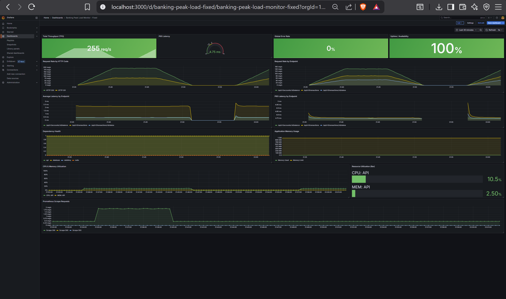
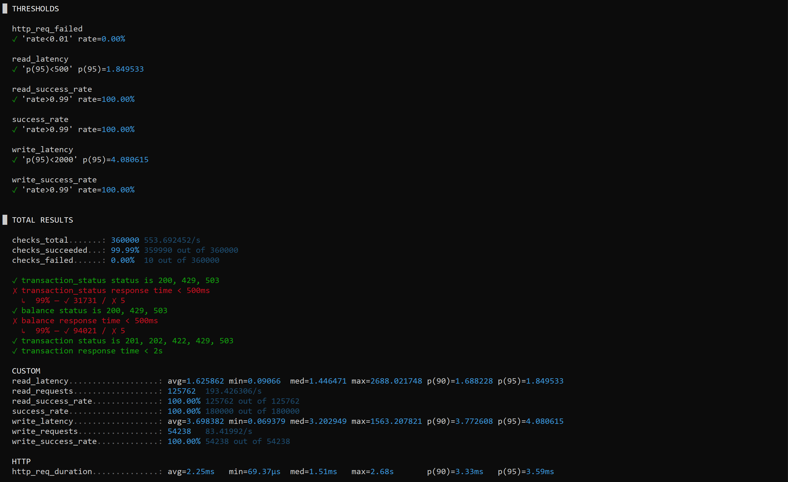

<h1 align="center">Banking Peak Load Prototype</h1>

<p align="center">
  A university prototype demonstrating defense-in-depth scalability for banking peak load — simulating CIMB Niaga's problem of 1M transactions/hour without crashing.
</p>

<p align="center">
  
  
  
  
  
  
  
  
  
</p>

---

## Problem Statement

A major bank experiences system crashes during peak load: **1M transactions/hour causing >20% error rate, >10s latency, and cost spikes**. Root causes: no backpressure, DB connection exhaustion, heavy queries without caching, and reactive (not proactive) scaling.

This prototype demonstrates how **four layered protection mechanisms** bring the system from unstable to production-grade.

---

## Results

| Metric | Baseline | Optimized | Improvement |
|---|---|---|---|
| p95 Latency (read) | > 2s | **1.85ms** | >1000× faster |
| p95 Latency (write) | > 5s | **4.08ms** | >1000× faster |
| Error Rate at peak | > 20% | **0.00%** | — |
| Max TPS | < 100 | **~278 req/s** | 2.8× throughput |
| Cache Hit Rate | N/A | **> 80%** | — |
| Availability | — | **100%** | — |

Grafana Dashboard:



k6 Load Test:



---

## Architecture

Defense-in-depth: four protection layers between client and database. Each layer reduces load on the layer below it.

```
Client Request
      │
      ▼
┌─────────────────────────┐
│  Layer 1: Rate Limiter  │  Token bucket per client IP → HTTP 429
└────────────┬────────────┘
             │
             ▼
┌─────────────────────────┐
│ Layer 2: Circuit Breaker│  Monitor downstream health → HTTP 503
└───────┬─────────┬───────┘
        │         │
      READ      WRITE
        │         │
        ▼         ▼
┌───────────┐  ┌──────────────┐
│ Layer 3a  │  │  Layer 3b    │
│ Redis     │  │  RabbitMQ    │
│ Cache     │  │  Queue       │
└─────┬─────┘  └──────┬───────┘
      │                │
      ▼                ▼
┌───────────┐  ┌──────────────┐
│  Read     │  │  Worker      │
│  Replica  │  │  Consumer    │
└─────┬─────┘  └──────┬───────┘
      │                │
      ▼                ▼
┌─────────────────────────┐
│  Layer 4: PostgreSQL 16 │
│  via PgBouncer pooling  │
│  Primary (write only)   │
│  Replica (read only)    │
└─────────────────────────┘
```

**Read path:** Rate limit → Circuit breaker → Redis cache → (miss) Read replica via PgBouncer → cache & return

**Write path (optimized):** Rate limit → Circuit breaker → Validate → Publish to RabbitMQ → HTTP 202 (async). Worker: check balance → debit/credit → commit → invalidate cache

**Write path (baseline):** Synchronous DB transaction → HTTP 201

---

## Tech Stack

| Component | Technology |
|---|---|
| Language | Go 1.25 + Echo router |
| Database | PostgreSQL 16 + PgBouncer (transaction pooling) |
| Cache | Redis 7 (cache-aside pattern) |
| Message Queue | RabbitMQ |
| Observability | Prometheus + Grafana |
| Load Testing | k6 |
| Infrastructure | Docker Compose (profile-based) + Kubernetes |
| CI | GitHub Actions |
| Dev tooling | air (live reload), golangci-lint, Nix flake |

---

## API Endpoints

| Method | Path | Description |
|---|---|---|
| `POST` | `/api/v1/transactions` | Create transaction (async when queue enabled) |
| `GET` | `/api/v1/transactions/:id/status` | Transaction status inquiry |
| `GET` | `/api/v1/accounts/:id/balance` | Account balance inquiry |

---

## Feature Flags

All protection layers are toggled via environment variables — baseline = all off, optimized = all on.

| Variable | Default | Description |
|---|---|---|
| `CACHE_ENABLED` | `false` | Redis cache for read path |
| `QUEUE_ENABLED` | `false` | Async write via message queue |
| `RATE_LIMIT_ENABLED` | `false` | Token bucket rate limiting |
| `CIRCUIT_BREAKER_ENABLED` | `false` | Fail-fast on unhealthy downstream |
| `DB_READ_REPLICA_ENABLED` | `false` | Route reads to replica |

See [Development Guide](docs/development.md) for the full environment variable reference.

---

## Quick Start

**Prerequisites:** Go 1.25, Docker & Docker Compose v2, k6, Make. For Kubernetes, also install `kubectl` and run a local cluster such as minikube or kind.

```bash
# Install Go tooling
make init
```

Seed dummy data (100K accounts, 1M transactions):

```bash
make seed
```

```bash
# Baseline (API + PostgreSQL only)
cp .env.baseline.example .env
docker compose up -d
k6 run scripts/load-test/mixed.js

# Optimized (+ Redis, RabbitMQ, read replica)
cp .env.optimized.example .env
docker compose --profile optimized up -d
k6 run scripts/load-test/mixed.js

# Full stack (+ Prometheus, Grafana)
docker compose --profile optimized --profile observability up -d
# Grafana:    http://localhost:3000
# Prometheus: http://localhost:9090
```

---

## Load Test Scripts

| Script | Traffic Model | Use it for |
|---|---|---|
| `scripts/load-test/mixed.js` | Realistic 70% read / 30% write workload. Reads split between balance inquiry and transaction status, with a hot-read pool to exercise Redis cache hits. | Main baseline vs optimized demo, Grafana validation, SLO checks for read p95 < 500ms and write p95 < 2s. |
| `scripts/load-test/optimized.js` | Write-only ramping load up to 1000 req/s against `POST /api/v1/transactions`. | Focused optimized write-path test, async queue, rate limiter, and write latency. |
| `scripts/load-test/rampup.js` | Write-only gradual ramp, configurable by `INITIAL_RATE`, `RATE_STEP`, `STAGE_DURATION`, and `MAX_STAGES`. | Finding the saturation point and watching when latency/errors start rising. |
| `scripts/load-test/spike.js` | Write-only short spike with increasing arrival rate. | Verifying protection behavior such as HTTP 429 rate limiting and HTTP 503 circuit breaking. |
| `scripts/load-test/sustained.js` | Write-only constant high load, default 800 req/s for 30 minutes. | Long-running stability checks for PgBouncer, RabbitMQ workers, and DB write pressure. |
| `scripts/load-test/full.js` | Write-only combined ramp-up, spike, and sustained phases. | End-to-end stress rehearsal when you want all write-pressure phases in one run. |

---

## Docker Compose Profiles

| Command | Services |
|---|---|
| `docker compose up` | API + PostgreSQL (baseline) |
| `docker compose --profile optimized up` | + Redis, RabbitMQ, read replica, PgBouncer |
| `docker compose --profile observability up` | + Prometheus, Grafana |
| `docker compose --profile optimized --profile observability up` | Full stack |

---

## Kubernetes

Kubernetes manifests are included under `deployments/k8s/` for demonstrating the same prototype stack in a cluster. Covers the app, PostgreSQL (primary + replica), PgBouncer, Redis, RabbitMQ, Prometheus, Grafana, ConfigMap/Secret, namespace, and HPA.

### Demo Steps

```bash
# 1. Start cluster
minikube start

# 2. Apply all manifests (safe to re-run)
make k8s-up

# 3. Wait until all pods are Running
make k8s-status
```

Open **4 separate terminals** for monitoring:

```bash
# Terminal 1 — App
make k8s-port-forward

# Terminal 2 — Grafana → http://localhost:3000 (admin/admin)
make k8s-port-forward-grafana

# Terminal 3 — Prometheus → http://localhost:9090
make k8s-port-forward-prometheus

# Terminal 4 — Watch auto-scaling live
kubectl get hpa -n banking -w
```

Seed data (requires Terminal 1 port-forward running):

```bash
make k8s-port-forward-db   # new terminal
make k8s-seed
```

Run load test:

```bash
make k8s-load-test
```

Shutdown:

```bash
kubectl scale deployment banking-app pgbouncer postgres redis rabbitmq prometheus grafana --replicas=0 -n banking
minikube stop
```

Resume next session:

```bash
minikube start
make k8s-up
make k8s-status   # wait until all Running
```

**If data is missing (account not found / insufficient funds):**

```bash
kubectl exec -it deployment/postgres -n banking -- psql -U postgres -d banking -c "TRUNCATE TABLE transactions, accounts RESTART IDENTITY CASCADE;"
make k8s-port-forward-db   # terminal 1
make k8s-seed              # terminal 2
```

> **Note:** The app manifest pulls `marquisccel/banking-peak-load:latest`. For local code changes, build and push your own image and update `deployments/k8s/app.yaml`. The HPA requires `metrics-server`; without it the app still runs but autoscaling metrics will not be available.

---

## Kubernetes Manifests

| File | Description |
|---|---|
| `secret.yaml` | DB credentials (base64 encoded) |
| `configmap.yaml` | App configuration and feature flags |
| `app.yaml` | Banking app deployment + NodePort service |
| `hpa.yaml` | Horizontal Pod Autoscaler (3–15 replicas, CPU 50%) |
| `pgbouncer.yaml` | PgBouncer connection pooler (2 replicas, pool size 50) |
| `postgres.yaml` | PostgreSQL primary + replica with tuned parameters |
| `redis.yaml` | Redis cache (LRU, 256MB) |
| `rabbitmq.yaml` | RabbitMQ message broker |
| `prometheus.yaml` | Metrics collection |
| `grafana.yaml` | Grafana deployment |
| `grafana-dashboard.yaml` | Grafana dashboard provisioning ConfigMap |

---

## Makefile Commands

| Command | Description |
|---|---|
| `make init` | Download Go modules and install dev tools (air, golangci-lint) |
| `make dev` | Start server with live reload (air) |
| `make lint` | Run golangci-lint |
| `make test` | Run unit tests (`go test -v ./...`) |
| `make build` | Compile binary to `bin/app` |
| `make seed` | Seed 100K accounts + 1M transactions (Docker Compose) |
| `make up` | Start the baseline Docker Compose stack |
| `make up-optimized` | Start the optimized Docker Compose stack |
| `make load-test` | Run mixed k6 workload against `http://localhost:8080` |
| `make k8s-up` | Apply all Kubernetes manifests |
| `make k8s-down` | Delete the Kubernetes stack |
| `make k8s-status` | Show pods, services, and HPA status |
| `make k8s-logs` | Follow logs from the banking-app deployment |
| `make k8s-port-forward` | Forward app service to `http://localhost:8080` |
| `make k8s-port-forward-db` | Forward PostgreSQL to `localhost:15432` for seeding |
| `make k8s-port-forward-prometheus` | Forward Prometheus to `http://localhost:9090` |
| `make k8s-port-forward-grafana` | Forward Grafana to `http://localhost:3000` |
| `make k8s-seed` | Seed data through the forwarded PostgreSQL service |
| `make k8s-load-test` | Run mixed k6 workload against the Kubernetes app |

---

## SLO Targets

| Metric | Baseline | Target | Achieved |
|---|---|---|---|
| p95 Latency (read) | > 2s | < 500ms | **1.85ms** ✅ |
| p95 Latency (write) | > 5s | < 2s | **4.08ms** ✅ |
| Error Rate at peak | > 20% | < 1% | **0.00%** ✅ |
| Read Success Rate | < 80% | > 99% | **100%** ✅ |
| Write Success Rate | < 80% | > 99% | **100%** ✅ |
| Cache Hit Rate | N/A | > 80% | > 80% ✅ |
| Availability | — | 99.5% | **100%** ✅ |

---

## Project Structure

```
banking-peak-load-prototype/
├── cmd/
│   ├── server/main.go          # Entry point
│   └── seeds/main.go           # Data seeder
├── internal/
│   ├── config/                 # Env-based configuration
│   ├── domain/                 # Domain models (account, transaction)
│   ├── handler/                # HTTP handlers
│   ├── infrastructure/         # DB, Redis, Queue clients
│   ├── middleware/             # Rate limiter, circuit breaker, logging
│   ├── metrics/                # Prometheus metric definitions
│   ├── repository/             # DB access + cache-aside logic
│   ├── service/                # Business logic
│   └── worker/                 # Queue consumer worker
├── migrations/                 # SQL migrations
├── scripts/
│   └── load-test/              # k6 scripts (mixed, optimized, spike, sustained, etc.)
├── deployments/
│   ├── docker/                 # Dockerfiles
│   ├── k8s/                    # Kubernetes manifests
│   ├── pgbouncer/              # PgBouncer config
│   ├── prometheus/             # prometheus.yml
│   └── grafana/                # Dashboard JSON provisioning
├── docs/                       # PRD, Architecture, ADRs
├── Makefile
└── docker-compose.yml
```

---

## Documentation

| Document | Description |
|---|---|
| [PRD](docs/prd.md) | Problem statement, requirements, success criteria |
| [Architecture](docs/architecture.md) | System design, read/write paths, DB schema |
| [Development Guide](docs/development.md) | Setup, env vars, conventions |
| [Workflow](docs/workflow.md) | Git branching, commit conventions, PR checklist |
| [ADR-001](docs/adrs/001-go-over-rust.md) | Go over Rust — language choice |
| [ADR-002](docs/adrs/002-feature-flag-over-branches.md) | Feature flags over branches for comparison |
| [ADR-003](docs/adrs/003-pgbouncer-connection-pooling.md) | PgBouncer for connection pooling |
| [ADR-004](docs/adrs/004-redis-caching-strategy.md) | Cache-aside pattern with Redis |
| [ADR-005](docs/adrs/005-async-write-via-queue.md) | Async writes via message queue |

---

## Testing

```bash
# Unit tests
go test ./...

# Integration tests (requires docker compose up)
go test -tags=integration ./...

# Load tests
k6 run scripts/load-test/mixed.js
k6 run scripts/load-test/optimized.js
```

---

<p align="center">
  <i>Built as a university capstone · Universitas Brawijaya · 2025</i>
</p>
